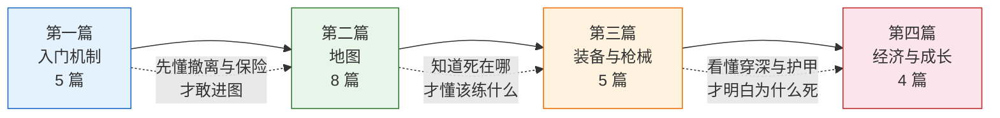

# 逃离塔科夫百科全书

> “这是一个没有 HUD、没有教学、没有第二次机会的世界。”
> —— 塔科夫，诺文斯克地区的封锁区

《逃离塔科夫》（Escape from Tarkov）是 Battlestate Games 开发的硬核战术撤离射击游戏。这个百科的目标是：**把“死得莫名其妙”变成“死得明白”**——每一篇条目都解释一个系统“是什么、为什么、怎么用”。

> 💡 本站**全文不使用配图**，弱网环境可流畅阅读。所有数值描述以“机制原理”为主，具体数值随版本变动，请以游戏内为准。

---

## 🧭 推荐学习路径

路径图只是建议。已经在玩的玩家可以直接跳到对应条目查漏补缺——**兴趣驱动的跳跃式阅读也是常见的打开方式**。

---

## 📚 推荐阅读顺序

### 第一篇：入门机制（先搞懂规则，再谈枪法）

| 顺序 | 条目 | 为什么这样排 |
|------|------|-------------|
| 1 | [撤离机制](entries/extraction.md) | 塔科夫唯一的胜利条件——搜刮再多，没撤离就等于零 |
| 2 | [生命与身体部位系统](entries/health.md) | 理解“为什么突然黑屏”——七部位血量与状态异常是生存的底层逻辑 |
| 3 | [保险机制](entries/insurance.md) | 新手最容易被忽略的“后悔药”，决定了你敢带什么进图 |
| 4 | [背包与容器系统](entries/inventory.md) | 安全箱与背包管理，是收益差距的第一来源 |
| 5 | [PMC 与 Scav](entries/pmc-scav.md) | 弄清两条命、两套规则，Scav 是新手的免费练习券 |

### 第二篇：地图（每张图一篇，按体量从小到大）

| 顺序 | 条目 | 为什么这样排 |
|------|------|-------------|
| 6 | [工厂](entries/factory.md) | 最小最乱的 CQB 图，练近战的课堂 |
| 7 | [海关](entries/customs.md) | 经典中的经典，任务最密集的中型图 |
| 8 | [森林](entries/woods.md) | 大型开阔图，狙击与听声辨位的考场 |
| 9 | [海岸线](entries/shoreline.md) | 疗养院垂直攻防与远距离交火并存 |
| 10 | [立交桥](entries/interchange.md) | 全室内商城，光线昏暗、背身刺杀频发 |
| 11 | [储备站](entries/reserve.md) | 军事基地与地下掩体，高价值任务枢纽 |
| 12 | [实验室](entries/labs.md) | 无 Scav、全 PMC 的顶级风险区 |
| 13 | [地面零点](entries/ground-zero.md) | 面向低等级玩家的市区图，任务起点 |

### 第三篇：装备与枪械（看懂数值，才知道为什么死）

| 顺序 | 条目 | 为什么这样排 |
|------|------|-------------|
| 14 | [弹药与穿深等级](entries/ammo.md) | **塔科夫第一真理：子弹比枪重要** |
| 15 | [弹道与穿透机制](entries/ballistics.md) | 穿深、护甲伤害、有效性衰减的底层规则 |
| 16 | [护甲与头盔](entries/armor.md) | 护甲等级、材质与耐久，护住哪里才划算 |
| 17 | [医疗物资](entries/medical.md) | 止血、复位、手术包的取舍与携带逻辑 |
| 18 | [枪械改装](entries/gunsmith.md) | 人机工效、后坐力、 ergo 的改装三角 |

### 第四篇：经济与成长（把每一条命变成资产）

| 顺序 | 条目 | 为什么这样排 |
|------|------|-------------|
| 19 | [商人系统](entries/traders.md) | 八位商人各有分工，声望就是购买力 |
| 20 | [跳蚤市场](entries/flea-market.md) | 玩家经济的中枢，变现与捡漏的主战场 |
| 21 | [藏身处](entries/hideout.md) | 离线收益与被动技能，穷人的复利 |
| 22 | [任务系统](entries/quests.md) | 商人声望、藏身处解锁、Kappa 容器的必经之路 |

---

## 📖 使用须知

1. **数值随版本变动**：塔科夫更新频繁，本站侧重机制原理与决策思路，具体数值以游戏内与官方公告为准。
2. **版本基线**：全站内容以 **2026 年 9 月 / 1.1.5.1 赛季第一赛季（KORD BREACH）** 的公开信息为基准；赛季修改器会改写部分规则，涉及赛季的机制请先看[重大版本更新史](docs/version-history.md)。
3. **条目内互链**：每篇末尾有“相关条目”，可按主题串联阅读。
4. **搜索优先**：站点支持全文搜索（右上角放大镜），术语中英对照都已覆盖。

## 📁 其他资源

- [机制速查表](docs/mechanics.md) — 一页看懂所有核心规则
- [新手成长路线](docs/progression.md) — 1 级到满级该干什么
- [重大版本更新史](docs/version-history.md) — 2016 至今的版本变迁、作用与玩家反馈
- [待收录清单](docs/roadmap.md) — 下一批条目的规划
- [条目模板](template.md) — 想贡献新条目从这里开始

---

📖 [查看全部 22 个条目](entries/index.md)

⬆️ **[回到顶部](#top)**

**最后更新**: 2026年9月
**贡献者**: GTX950L
**License**: MIT
