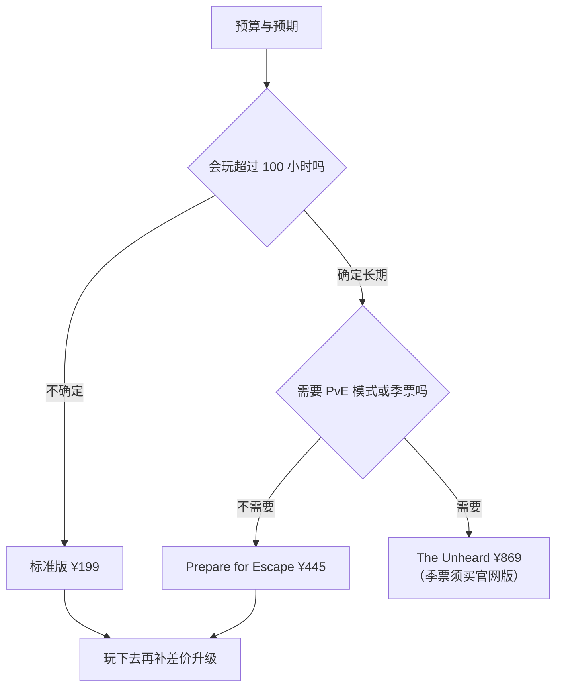

---
tags:
  - 速查
---
# 购买指南：地区与版本怎么选

> 本站其余页面讲的是“进游戏之后”。这一页讲“进游戏之前”——买哪一档、在哪个平台买、买哪个地区、什么时候买最划算。
>
> **价格与地区政策是本站变动最频繁的内容**。本文数据基线：**游戏版本 1.1.5.1**，价格取**官方中国区定价（2026 年 2 月起生效）**；Steam 渠道的价格单独标注，两者并不总是相同。下单前请以购买页面的实时报价为准。

---

## ⚠️ 先弄清三件事

**第一，塔科夫没有“国服”。**
所谓“中国区”只是一个**定价区**，不是服务器区。游戏服务器全部在海外，简体中文界面与字幕由客户端提供，与你在哪个服务器与谁对战无关。网络连接方式与[听声辨位与音频机制](../entries/audio.md)里的延迟问题另说，但与购买决策无关。

**第二，“区域锁”锁的是启动地点，不是对战对象。**
官方对此的表述很明确：区域锁**不意味着你不能和其他地区、其他服务器的玩家一起玩**——它只意味着你的客户端只能在购买地区物理启动。跨区启动会直接报错（错误代码 **208**）。

**第三，版本权益里真正影响长期体验的只有三样**：保险箱尺寸、是否含 PvE 与季票、商人初始好感。仓库可以后期扩容，装备会被打光，只有这三样是买定离手、游戏内无法完全追平的。其中季票有个**渠道陷阱**：它只跟着**官网版**蓝边走，**Steam 版蓝边不含季票**——这是本文最需要看清的一条，详见下文[两条购买渠道](#channels)。

---

## 📦 版本体系：在售四档，另有一档已停售

塔科夫历史上共出现过五个版本。**目前官网与 Steam 在售的都是这四档**（Steam 上的蓝边自 **2026 年 5 月 20 日**起才可购买）：

| 版本（俗称） | 保险箱 | 仓库 | 战局内经验 | 关键权益 | 中国区定价 |
|------|--------|------|-----------|----------|-----------|
| **标准版** Standard · **白边** | Alpha **2×2** | 10×30 | — | 本体 | **¥199** |
| **Left Behind** · 留守版 | Alpha **2×2** | 10×40 | **+7%** | 专属装备与技能套装 | **¥330** |
| **Prepare for Escape** · 准备逃离版 | Beta **3×2** | 10×50 | **+9%** | **全商人初始好感** | **¥445** |
| **The Unheard** · **蓝边** | Gamma **3×3** | 10×72 | **+20%** | 含 **Arena Ryzhy 版**、**PvE 模式**、**季票（后续 DLC，仅官网版含）**、游戏内唯一标识、仪式圈、专属近战与服饰、跳蚤市场额外槽位、口袋扩容 | **¥869** |
| ~~Edge of Darkness~~ · 黑边 | Gamma 3×3 | 10×68 | +12% | 同上（老玩家权益保留） | **已停售** |

> **俗称对照：白边、蓝边、黑边到底指什么。**
> 这三个称呼是**国内社区按版本标识与主题色起的绰号，不是官方名称**，但因为流传太广，看老攻略时绕不开：
>
> - **白边** = **Standard 标准版**（最便宜那一档）；
> - **蓝边** = **The Unheard**（因主题色为蓝，也有人叫**金边**）；官网中文把它译作**“未闻者版”**；
> - **黑边** = 已停售的 **Edge of Darkness（EoD）**。
>
> Left Behind 在不同渠道有**“留守版”“遗落版”**两种译法，Prepare for Escape 多称**“准备逃离版”**，其实是同一个版本。
>
> 需要提醒的是：**“白边”与“蓝边”中间隔着 Left Behind 与 Prepare for Escape 两档**，中国区差价接近 ¥670。把选择简化成**“白边还是蓝边”**的二选一，会直接跳过中间两档的性价比区间。

> **关于已停售的“黑边”**：Edge of Darkness 因 2024 年 Unheard 风波后已停止销售，官方支持页明确标注“not available for purchase”。它的权益被 The Unheard 继承并加强（经验加成 +12% → +20%、仓库 10×68 → 10×72）。**已有权益的老账号不受影响**，但新玩家无法再买到——任何声称能提供“全新黑边”的渠道都值得警惕。

---

## 🎯 怎么选：三个分水岭

不用把上面那张表逐列对比，只要依次过三道坎。

**第一道坎：保险箱 2×2 → 3×2 → 3×3。**
这是全版本体系里最硬的分水岭。安全箱内的物品**死亡不丢**（见[背包与容器系统](../entries/inventory.md)），2×2 只能塞下一把钥匙加一个任务物品，3×3 能塞下一整组高价值小件。**Alpha 与 Beta 之间的差距，比 Beta 与 Gamma 之间的差距更大**——前者决定“能不能带任务物品进图”，后者只影响“一次能带几件”。

**第二道坎：PvE 与季票。**
PvE 模式（进度不随删档重置）是**独立付费项，¥119**。季票（后续 DLC 访问权）目前**只能通过 The Unheard 获得**。如果你确定只玩 PvP、也不需要后续 DLC，为这两项付 ¥424 的差价不划算。

**第三道坎：商人初始好感与经验加成。**
PFE 的“全商人初始好感”与 Unheard 的 +20% 经验，都是**压缩前期而不是改变上限**的东西。前期少卡几天，长期看会被抹平。**不要为这一项单独升档**。

**结论式建议**：

| 你的情况 | 建议 |
|----------|------|
| 第一次接触撤离类游戏，不确定能否玩下去 | **标准版**——先验证自己是否喜欢这套机制 |
| 已经确认喜欢，打算长期玩，只玩 PvP | **Prepare for Escape**——性价比拐点 |
| 需要 PvE 模式 | **The Unheard**（内含 PvE，不必再单独买），或任意版本 + 单买 PvE **¥119** |
| **想一次拿全后续所有 DLC** | **只能买官网版** The Unheard——**Steam 版蓝边不含季票**，详见下文渠道对比 |
| 预算极紧，但想要大保险箱 | 标准版 + 后期攒钱升级，见下文“升级路径” |

---

## 🧩 独立付费项一览

这些**不包含在四档版本里**（Unheard 除外），需要单独购买：

| 项目 | 中国区定价 | 说明 |
|------|-----------|------|
| PvE 模式 | **¥119** | 进度不删档的合作模式；Unheard 已含 |
| PvE + Arena 组合包 | **¥219** | 比单买便宜约 ¥39 |
| Escape from Tarkov: Arena | **¥139** | 独立竞技项目；Unheard 已含 Ryzhy 版 |
| Arena 战术地图 | **¥59** | Arena 内购 |
| Arena 10 个战斗通行证等级 | **¥20** | Arena 内购 |
| 仓库容量升级（**+2 行**）| **¥12** | 可叠加，是仓库最便宜的补法 |
| 服饰解锁（BEAR / USEC 各款）| **¥19 – ¥55** | 纯外观，不影响任何数值 |

> **仓库扩容是最典型的“别为它买版本”。** 每 2 行只要 ¥12，标准版的 10×30 补到 10×72 也只花几十元——但**补不到 The Unheard 的起步优势**，而且要一行一行手动加。想省这一步就买高版本，想省钱就慢慢扩容，两条路都成立。

---

## 🛒 两条购买渠道：官网与 Steam

两个渠道都能买，但规则不同。

### 官网（Battlestate Games 官方商店）

- 直连官网下单，支付通过 **Xsolla** 完成（支持支付宝等国内常用方式）；
- 版本最全，扩展项（PvE、仓库行、服饰）与升级项目都在这里；
- 官网账号是**唯一的账号体系**——无论在哪买，最终都要用 BSG 账号登录。

### Steam

Steam 版于 **2025 年 11 月 15 日**（与 1.0 正式版同日）上架，但它有一条几乎所有人都会踩的规则：

> **已有官网版的玩家，想在 Steam 上玩，必须在 Steam 再买一份。** Steam 版被视为一个**独立的购买渠道**，不提供账号或进度的免费迁移。

不过这里有一个**关键的省钱点**，官方 FAQ 写得很清楚：

> **如果你已经拥有更高版本（如 The Unheard 或已停售的 Edge of Darkness），在 Steam 只需购买标准版即可。** 绑定 BSG 账号后，游戏会自动识别并使用你账号上**最高的那个版本**。

反过来说：**如果你先买了 Steam 标准版，之后想要 PvE，仍然要回到官网或 Steam 单独买 PvE 扩展**——Steam 上的 PvE Zone 单独售价 **¥119**，与官网同价，Steam 版不会自动升级你的官网权益。

### ⚠️ 蓝边的渠道差异：官网版含季票，Steam 版不含

这是两个渠道**唯一一处实质性的版本权益差异**，也是“蓝边”这个俗称最容易误导人的地方。

**Steam 版蓝边是单独的一件商品**（商品名 *The Unheard Steam Edition*，**2026 年 5 月 20 日**上架，比 Steam 本体晚了半年），商店页面的官方说明原文是：

> Please note: The Unheard Steam Edition does not include Season Pass. This limitation is caused by Steam platform rules and was taken into account in pricing.
>
> 译：**Steam 版 The Unheard 不包含季票。这一限制由 Steam 平台规则造成，并已在定价中予以考虑。**

这句话有三层意思，逐层拆开看：

1. **缺的不是“内容”，是季票。** PvE 模式、Arena Ryzhy 版、Gamma 保险箱 3×3、10×72 仓库、口袋扩容、全商人初始好感、+20% 经验（全队共享）、跨阵营服饰、专属近战与游戏内标识——**Steam 版蓝边一样不少**。唯一缺的是季票，也就是**后续所有 DLC 的访问权**。
2. **原因是平台规则，不是区别对待。** 官方把原因明确挂在 Steam 侧，而不是说“我们特意砍掉了”。
3. **价格确实降了。** 官网中国区蓝边 **¥869**，Steam 中国区蓝边 **¥758.99**（本次核对时的实时报价），差约 **¥110**——这个差价大致就是季票的那一份钱。

**这对你意味着什么？**

| 你的打算 | 结论 |
|----------|------|
| 只玩当前内容，不打算追后续 DLC | **Steam 版蓝边更划算**，省下的钱是真的省下 |
| 打算长期跟到后续 DLC | **选官网版**——Steam 版将来要为每个 DLC 单独付费，总价很可能反超官网版 |

**一个重要前提：季票现在还没有“现货”。** 到本文更新时为止，官方**尚未正式发售任何一款内容型 DLC**——季票买到的是**未来 DLC 的期权**，不是已经能玩到的东西。所以上面那 ¥110 的差额，本质是**对赌未来 DLC 的规模与数量**，而不是买与不买一份现成内容。

**如果我已经有官网版蓝边，再补一份 Steam 版，季票会丢吗？**

不会——**季票是绑定在 BSG 账号上的权益，不是绑在 Steam 账号上的**。官方 FAQ 的规则是“实际游玩版本取两个账号中更高的那个”，所以你在 Steam 补一份标准版之后，游戏仍会按账号上的 The Unheard 权益运行，季票随账号保留。**但官方没有对这一组合逐字说明**（Steam FAQ 只写了“Steam 版不含季票”这一句），如果你很在意，下单前可直接找客服确认。

**未来 DLC 在 Steam 上怎么买？** 官方**没有公布**。目前能确定的只有“Steam 版不含季票”这一条。从 Steam 现有做法看（PvE、Arena 内容等都是以独立 DLC 条目挂在库里的），未来 DLC 大概率会**作为 Steam DLC 单独上架**。**这属于合理推断，不是官方口径**，别当成承诺。

Steam 版的其他限制：

| 项目 | 情况 |
|------|------|
| 是否需要 BSG 账号 | **需要**，且需手动绑定 Steam 账号 |
| 启动方式 | 仍走 BSG 启动器（Steam 只负责分发与库内启动） |
| 跨平台对战 | **同服**——官方明确：所有玩家在同一批服务器上，与在哪买无关 |
| 季票 / 后续 DLC | Steam 版蓝边**不含季票**（官方原文见上）；未来 DLC 的 Steam 销售方式官方未公布 |
| 家庭共享 | **不支持** |
| Steam Deck | **不支持**（官方标注 Unsupported） |
| 成就 | 支持（**98 个**，随版本更新递增） |

**该选哪个？**

- 想要**最完整的购买与升级选项**、想用支付宝 → 官网；
- 想要**库内统一管理、Steam 成就与钱包余额** → Steam；
- **想买蓝边**：在意后续 DLC → **官网**；不在意后续 DLC → **Steam 版便宜约 ¥110**；
- 已经在官网投了钱、又想要 Steam 的界面 → 补一份 Steam 标准版（不是必须，属于为便利付费），账号上的原有版本权益与季票会被自动沿用。

### 🚫 不要买的渠道

**第三方 key 站（G2A、Kinguin 等）与二手账号。** 这不是保守建议：塔科夫的 key 与账号绑定极紧，来路不明的 key 存在**被回收后账号连带受损**的风险，二手账号则可能触及账号共享与所有权问题。官方从未授权任何第三方分销。

---

## 🌍 地区定价与区域锁

### 中国区定价（2026 年 2 月 10 日起生效）

这是近年对国内玩家影响最大的一次变化——**官方为中国大陆地区设立了独立定价，并整体下调**：

| 版本 | 官网中国区定价 | Steam 中国区核对价 | 此前参考价 |
|------|---------------|-------------------|-----------|
| 标准版 | **¥199** | ¥199.99 | ¥285 |
| Left Behind | **¥330** | ¥329.99 | ¥470 |
| Prepare for Escape | **¥445** | ¥444.99 | ¥635 |
| The Unheard | **¥869** | **¥758.99**（不含季票） | — |
| Arena | **¥139** | — | — |

**两条渠道的价格基本对齐，唯一的例外就是蓝边**——Steam 版比官网版便宜约 ¥110，差额对应的是它不含的季票（详见上文[蓝边的渠道差异](#unheard-steam)）。扩展项（PvE、仓库行、服饰）在两条渠道**同样适用地区定价**，核对时 Steam 上的 PvE Zone 为 **¥119**，与官网一致。

**必须弄清的四条规则**（均出自官方中国区 FAQ）：

1. **不能把已有账号改成中国区。** 想享受中国区定价，只能**新建账号并重新购买**，地区定价随新账号生效。
2. **中国区定价会随活动同比例打折。** 折扣季时按全价的比例下调，不是固定减额。
3. **中国香港、中国澳门、中国台湾地区不包含在中国大陆定价区内。**
4. **购买时不要开 VPN。** 官方明确提示：开代理购买可能让你**买错地区版本**。

### 区域锁的实际含义

| 误解 | 实际情况 |
|------|----------|
| “买了中国区就只能和中国区玩家玩” | ❌ 官方明确：区域锁**只限制启动地点**，可以和其他地区玩家、其他服务器一起游戏 |
| “在哪买都一样” | ❌ 跨区启动会报**错误 208**，客户端在购买地区之外无法运行 |
| “买错区就只能重买” | ⚠️ 可补救：登录个人资料页，用 **Change region** 购买**地区升级**（升级费用另计） |

**一条实用建议（官方原话的意思）**：**如果你经常出行，EU 版才是省心的选择**——它的覆盖范围最广，是唯一官方推荐的“到处跑”版本。

---

## ⏰ 什么时候买：折扣规律

塔科夫**打折非常频繁**，一年大致 4–6 次，通常绑定季节特卖与大型版本更新。

### 实测折扣记录（2026 年）

| 时间 | 活动 | 折扣 |
|------|------|------|
| 2026-05-26 – 06-01 | 春季特卖（随 1.0.5.0 破冰船上线） | Left Behind / Prepare for Escape **20% off**；The Unheard **25% off**；服饰、仓库行、PvE **15% off** |
| 2026-06-25 – 07-09 | Steam 夏季特卖 | 标准版 **25% off**；Left Behind / PFE **15% off**；PvE **10% off** |

从 Steam 的价格历史看，2025 年 11 月（1.0 上线月）到 2026 年 6 月之间，**几乎每个月都有折扣窗口**，标准版的最低价一度到基础价的 **75%**。

### 三条结论

**1. 折扣同时覆盖“购买”与“升级”。**
这一点常被误解。春季特卖的官方措辞是**“购买或升级至 Left Behind 版本，立享 8 折”**——也就是说**升级项目本身也会打折**。所谓“升级永远不打折”的说法并不成立。

**2. 最低成本路径是“在目标版本上等活动”，而不是“先买便宜后升级”。**
因为每次活动的折扣档位不同：夏季特卖给标准版 25%、却只给 Left Behind 与 PFE 15%；春季特卖则给 The Unheard 25%。**先买低档再升级，会额外承担一次非折扣期的差价风险。**

**3. 两档之间的价差是固定的，折扣不同步会放大差距。**
中国区定价是固定价目，因此**升级差价 = 目标版本价 − 当前版本价**（活动期按各自折后价计算）。在你已经确定要哪一档的前提下，**直接等那一档打折**，永远比“找折扣最大的那一档先买”更划算。

---

## ✅ 避坑清单

| 事项 | 说明 |
|------|------|
| **官方已支持简体中文** | 界面与字幕官方支持，**不需要任何汉化补丁**。旧攻略里“官方无中文、要打补丁”的说法已经过时；使用非官方修改文件反而有被反作弊识别的风险 |
| **系统与空间** | 官方标称需要 **80 GB** 可用空间；最低配置参考 GTX 1660 级别、16 GB 内存，推荐配置要求已到 RTX 4070 与 64 GB 内存 |
| **先想清楚 PvP 还是 PvE** | 两者是**分开付费**的。只玩 PvE 就不必为 PvP 版本权益付高价；但 PvE 的进度不删档特性决定了它更适合时间有限的玩家 |
| **别把“蓝边”当成一件商品** | 官网蓝边**含季票**、Steam 蓝边**不含季票**，两者不是同一件东西，价差约 ¥110。买之前先确认自己在哪个渠道、是否在意后续 DLC |
| **不要为“黑边”付溢价** | Edge of Darkness 已停售，市面上的“全新黑边”渠道都不可信 |
| **别用别人账号试玩** | 账号共享与异地登录在塔科夫属于高风险行为 |
| **下单前确认地区** | 页面会显示你当前的访问地区；开着 VPN 下单是最常见的买错原因 |

---

## 🔗 相关条目

- [重生与赛季机制](../entries/seasons.md) — 赛季角色与持久角色的区别，直接影响你该不该买季票
- [新手成长路线](progression.md) — 买完之后的第一个月该干什么
- [重大版本更新史](version-history.md) — 各版本与定价调整的来龙去脉
- [背包与容器系统](../entries/inventory.md) — 保险箱尺寸为什么是版本分水岭

## 📚 所有条目

📖 [查看全部 57 个条目](../entries/index.md)

---

⬆️ **[回到顶部](#top)**

**最后更新**: 2026年9月
